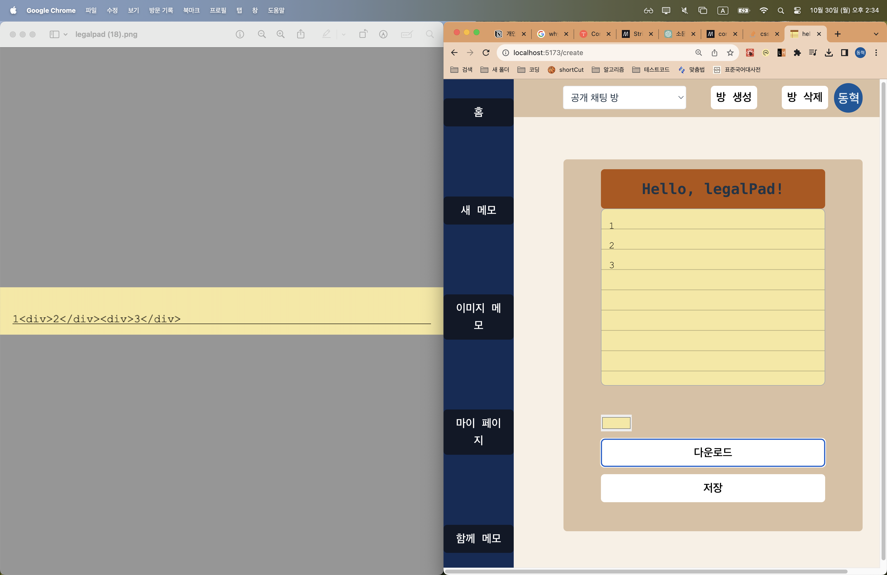
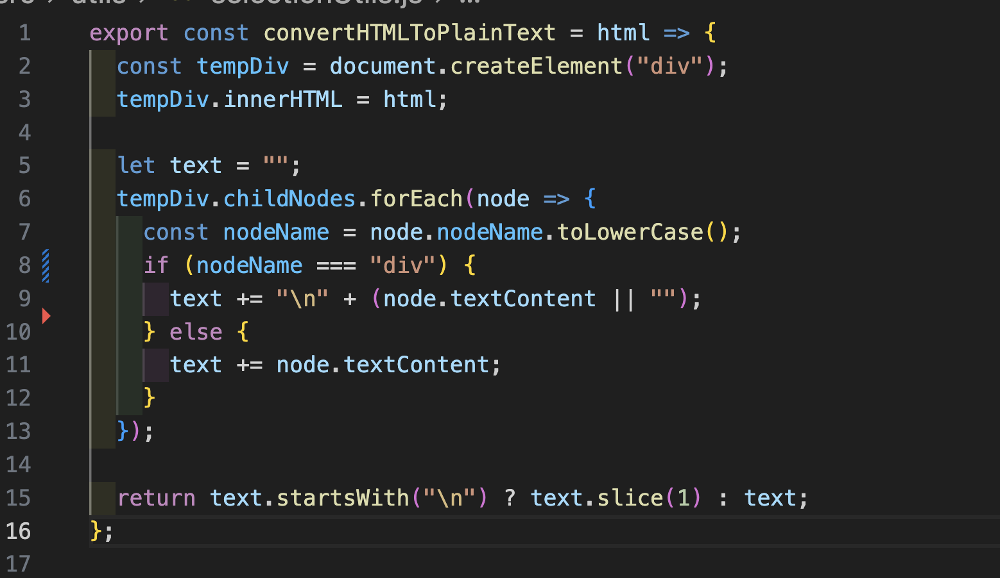
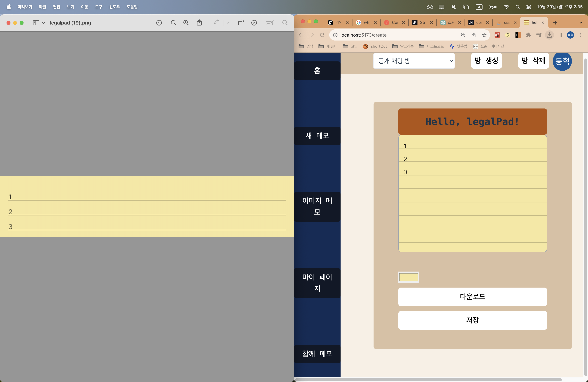

# 목차

- [동기](#동기)
- [주요 기능 소개](#주요-기능-소개)
- [프로젝트 관심사](#프로젝트-관심사)
- [기술스택](#기술스택)
- [느낀점](#느낀점)
- [연락처](#연락처)

---

# 동기

- 노트에 필기하는 걸 좋아했습니다. 그런데 작성한 노트를 그냥 버리기 아까울 때가 많았습니다. 생각이 어떻게 발전되어 왔는지를 되돌아볼 수 있었기 때문이었습니다. legalpad라는 특정 메모장에 메모하는 것을 좋아했고 이를 테마로 한 메모 웹 애플리케이션을 만들고자 했습니다.

# 주요 기능 소개

- 메모 작성, 다운로드, 공유하기 등이 주요 기능입니다. 이러한 기능 구현에 contentEditable을 사용했습니다.

- 소켓을 통해 다른 사용자와 함께 메모할 수 있도록 하였고 이때, 사용자의 cursor 위치를 시각화했습니다. 또한 현재 입력 중인 사용자를 화면 하단에 표시했습니다.

- Google Cloud Vision API를 사용하여 작성한 메모에서 손 글씨를 인식합니다. (OCR)

---

- **텍스트 생성** (색상 변경, 이미지 다운로드 기능)

  

- **함께 메모하기**

  

  

- **손글씨 인식** (OCR 기능)

  

# 프로젝트 관심사

## contentEditable

### contentEditable 도입한 이유

- 메모 앱 애플리케이션을 구현하기 위해선 사용자의 입력을 전달받아야 합니다. 이를 위해서 처음에는 `textarea` 태그를 사용하여 개발을 시작했습니다. `textarea`를 사용하면 별도의 추가 조치 없이 사용자 input을 렌더링할 수 있습니다. 하지만 사용자의 cursor 위치를 시각화하기 위 좌표를 계산해야 했고 이를 위해 Selection API와 Range API를 사용했어야만 했습니다. 하지만 `textarea`에서 이 기술들을 적용하지 못한다는 것을 알게 되었습니다. 그 이유는 Selection과 Range API는 주로 contenteditable 속성을 가진 요소나 document 객체에서 작동하도록 설계되었기 때문입니다.`textarea`는 텍스트가 DOM 노드로 분리되어 있지 않고 단일한 문자열로 취급되기 때문에, 이러한 API를 사용하는 것이 어렵거나 비효율적입니다.(`textarea` Selection과 Range API를 사용하는 것보다는 `textarea` 자체의 속성과 메서드를 사용하여 텍스트 선택과 조작을 하는 것이 일반적입니다. 예를 들어, textarea의 value, selectionStart, selectionEnd 속성을 사용하여 사용자의 텍스트 선택을 관리하거나 조작할 수 있습니다.)

- 또한 텍스트에디터 기능, 예를 들어 사용자가 글씨를 쓰고 제목을 표시하게 하는 기능, 마크다운 문법 적용 등을 적용하는 데 `textarea` 방식이 한계가 있다고 생각했습니다. 따라서 프로젝트가 확장될 것을 고려한 결과, 개발 도중 `textarea` 방식을 사용하는 것을 중단하고 `contentEditable`을 이용하여 프로덕트를 개발하게 되었습니다.

### 비제어 컴포넌트

| 특성            | 제어 컴포넌트 (`input`)                   | 비제어 컴포넌트 (`contentEditable`)          |
| --------------- | ----------------------------------------- | -------------------------------------------- |
| **데이터 흐름** | 위에서 아래로 (Top-down)                  | 사용자에 의한 직접 DOM 편집                  |
| **이벤트 처리** | `onChange` 이벤트를 사용하여 `value` 관리 | `input` 이벤트를 사용, `value` 속성 없음     |
| **DOM 제어**    | React가 DOM을 직접 제어                   | React 외부에서 DOM 제어                      |
| **상태 관리**   | React 상태에 따라 `value` 관리            | 직접 DOM 조작으로 내용 관리                  |
| **용도**        | 양식 입력과 같은 정형화된 데이터 처리     | 복잡한 텍스트 편집기 등의 비정형 데이터 처리 |

- `contentEditable`의 사용은 React 데이터 흐름에서 벗어나 사용자에 의해 제어되지 않은 입력값이(사용자에 의한 직접 DOM 편집) 렌더링 되기에비제어 컴포넌트 방식이라고 할 수 있습니다.

- 제어 컴포넌트에 관한 예시로 보통 `input`을 이용한 개발을 설명합니다. `input`은 onChange로 value를 상태 관리합니다. 이러한 React 통제 아래의 제어 컴포넌트에서는 데이터 흐름이 위에서 아래로만 작동합니다. 즉, 최상위 수준에서 모델을 관리하고 해당 데이터를 나타내는 가상 DOM을 유지한 다음 해당 가상 DOM을 기반으로 DOM 트리를 렌더링합니다.

- 반면에 `contentEditable`을 이용한 개발은 동작 방식이 다릅니다. `contentEditable`은 입력 시 change event가 아니라 input event가 동작하고 또한, input이 아니어서 value 값이 없습니다. 이 때문에 제어 컴포넌트처럼 리액트가 DOM을 제어할 수가 없습니다. 따라서 `contentEditable`은 제어 컴포넌트와 다른 방식으로 제어를 해줘야 합니다.

### 비제어 컴포넌트를 사용하여 사용자 입력값 렌더링하기

- 프로젝트에서 적용한 시나리오는 다음과 같습니다.

| 단계                             | 설명                                                                                                                                                                                              |
| -------------------------------- | ------------------------------------------------------------------------------------------------------------------------------------------------------------------------------------------------- |
| **contentEditable 속성 사용**    | `div` 태그에 `contentEditable="true"` 속성을 부여하여 사용자가 텍스트를 편집할 수 있게 합니다.                                                                                                    |
| **사용자 입력 추적**             | 사용자가 텍스트를 입력하면 `event.target.innerHTML`에서 변경된 HTML 콘텐츠를 조회합니다.                                                                                                          |
| **상태 관리**                    | React의 `useState`를 이용하여 `div`의 내용을 상태로 저장하고 관리합니다. 사용자의 입력에 따라 상태 값을 업데이트합니다. 이 상태는 프로젝트의 기능 (CRUD, image download)을 구현하는데 이용됩니다. |
| **useRef를 이용한 요소 접근**    | React의 `useRef` 훅을 사용하여 `div` 요소에 직접 접근합니다. 필요할 때 `div` 요소의 내용을 직접 조작하거나 정보를 얻습니다.                                                                       |
| **useEffect를 이용한 UI update** | `useEffect` 훅의 의존성 배열에 상태 변수를 넣어 사용자의 입력이 있을 때마다 컴포넌트가 렌더링되도록 합니다. 이를 통해 사용자 입력에 따라 UI가 update 되는 것을 보장합니다.                        |
| **요약**                         | `contentEditable` 속성을 사용하여 비제어 컴포넌트 방식으로 사용자 입력을 처리하고, React `useState`를 통해 프로젝트 핵심 기능에 필요한 상태를 도입하였고 `useRef`를 통해 UI를 갱신했습니다.       |

### 사용자 입력 값을 렌더링할 때 발생했던 문제

> A component is “contentEditable” and contains “children” managed by React.

- 사용자가 입력한 값은 contentEditable 영역의 `event.target.innerHTML`에서 조회할 수 있습니다. 이 값을 상태로 관리하고 해당 상태를 div contentEditable의 content 영역에 넣게 되면 렌더링 시 cursor 초기화 및 위와 같은 warning이 발생합니다.

- 이 warning은 `suppressContentEditableWarning={true}`를 통해 막을 수도 있습지만, 좋지 않은 결정이라 판단했습니다. 왜냐하면 해당 경고를 막으면, element의 innerHTML을 직접 조작하는 방식은 React의 제어 대상에서 벗어나서, React는 DOM이 변경되었는지 알 수가 없기 때문이었습니다. 사용자가 contentEditable element를 수정하면 실제 DOM이 변경되고 React의 가상 DOM은 이러한 변경 사항을 자동으로 인식하지 않습니다. 결국 다음 rendering 시에 content에 해당 DOM node의 올바른 상태라고 생각하는 것을 React가 overwrite 시켜서 사용자 입력값과 일치하지 않는 문제가 발생합니다. 실제 DOM 조작에 의해서 React 가상 DOM을 일관되게 유지하는 데 문제가 될 수 있습니다.

- cursor 위치 초기화 문제

  - 따라서 element의 innerHTML를 조작하는 방식 대신 element에 `dangerouslySetInnerHTML` 속성을 부여하는 것을 적용해 보았습니다. `dangerouslySetInnerHTML`은 React의 method입니다. React는 가상 DOM을 사용하기 때문에, 실제 DOM과 차이를 비교할 때 HTML이 다른 소스에서 왔다는 것을 알 수 있습니다. 따라서 해당 노드의 자식을 검사하는 것을 바로 건너뛸 수 있고 성능이 향상되는 장점이 생깁니다. 하지만 `dangerouslySetInnerHTML`을 이용한 방식은 cursor 위치 초기화 문제가 발생합니다. 문제의 원인은 텍스트 입력값을 상태로 관리하게 되면 입력 시마다 상태가 변경되고 React에 의해 렌더링이 발생해서 cursor가 초기화되었던 것이었습니다. 이를 carret jump라고 부른다는 것을 알게 되었고 따라서 carret jump 없이 사용자 입력에 따라서 컴포넌트를 업데이트할 방법을 찾아야만 했습니다.

- 결론:

  결론을 정리하면 다음과 같습니다.

  | 단계                          | 설명                                                                                                                              |
  | ----------------------------- | --------------------------------------------------------------------------------------------------------------------------------- |
  | **사용한 접근 방식**          | `contentEditable = true`을 사용하고 사용자 텍스트 입력값을 `event.target.innerHTML`에서 확인했습니다.                             |
  | **상태 관리**                 | React로 상태 관리하여 해당 데이터가 필요한 함수에 전달했습니다.                                                                   |
  | **사용자 입력값 초기화 문제** | 사용자 입력값이 초기화되는 문제를 막고 연속되게 입력되게 하기 위해 `useRef`로 해당 element를 조회했습니다.                        |
  | **렌더링 최적화**             | `useEffect`의 의존성 배열에 `event.currentTarget.innerHTML`을 담은 변수를 넣어서 텍스트값이 갱신될 때마다 렌더링 되게 하였습니다. |

### image download 기능에서 발생했던 문제

- 몇 번의 실험 끝에 렌더링 자체는 문제가 없어 보였습니다. 하지만 프로젝트의 핵심 기능인 이미지 다운로드 기능에서 문제가 생겼습니다. contentEditable 속성이 있는 `div`에서 사용자가 enter 키를 누르면, 웹 브라우저가 새로운 줄을 생성하기 위해 새로운 `
` 태그를 자동으로 삽입합니다. 이에 따라서 줄 변경을 하면 다운로드 이미지에서 입력 테스트와 함께 의도하지 않은 `div` 태그가 나타났습니다.

  

    
  

- 이를 해결 하기 위해 아래 사진의 `convertPlainTextToHTML`를 사용하여, HTML 요소의 구조와 상관없이 내부의 텍스트 값만 추출하고, 줄 바꿈을 적절히 유지하여 일반 텍스트로 변환하였습니다. `convertToHTMLToPlainText`의 반환 값, 즉 텍스트만을 상태 관리하여서 이미지 다운로드를 담당하는 함수에 매개 변수로 전달하여 정상적인 모습을 이미지가 다운로드 되게 하였습니다.

  

    >
  

  

  
  

## 소켓을 이용한 실시간 메모 기능

### Socket IO 도입한 이유

- 여러 사용자가 함께 앱을 사용할 수 있게 하고 싶었습니다. 처음에는 소켓을 이용한 실시간 채팅 기능이 구현된 페이지 만들고자 했습니다. 하지만 메모 앱을 지향하는 프로덕트에 갑작스레 실시간 채팅 기능을 추가하면 프로덕트의 정체성을 해칠 것 같았습니다. 따라서 메모 앱이라는 아이덴티티를 유지하면서도 "실시간으로 함께 메모" 기능을 구현해 보고 싶었고 기존의 TextEditor 컴포넌트를 활용하여 구현하기로 하였습니다. 의도했던 바는 Google Docs처럼 다른 사용자의 커서 위치를 시각화해서 사용자가 실시간으로 함께 메모할 수 있도록 하는 것이었습니다. 여기에 더해 Slack처럼 입력 창 하단에 어떤 사용자가 입력 중인지를 표시하고자 했습니다. 실시간 협업 기능을 갖춘 애플리케이션을 만들려면 클라이언트와 서버 간에 실시간으로 데이터를 송수신할 수 있어야 합니다. **`socket.io`**는 실시간 양방향 이벤트 기반 통신을 가능하게 하는 라이브러리로, 실시간 메모 기능을 구현하는 데 적합하다고 판단하여 프로젝트에 도입하게 되었습니다.

### 커서 위치 시각화 위치가 맞지 않는 문제를 어떻게 해결했는지?

- 이를 위해 채택한 방식은 소켓의 `textChanged`이벤트를 통해서 사용자 간에 `text`, `cursorPosition`, `userPhotoURL`을 서로 공유하고 이를 다른 사용자의 브라우저에서 커서 위치 시각화에 사용하는 것입니다.

- DOM API의 getBoundingClientRect()을 이용한 방식

  - 

  - 브라우저에서 커서위치에 해당하는 변수 cursorPosition을 계산하고 그 값을 소켓으로 통신하고 데이터를 전달받은 사용자가 상대 사용자의 데이터를 이용하여 커서위치를 렌더링하는 시나리오를 구상하였습니다. 이를 위해 웹 브라우저가 제공하는 DOM API의 getBoundingClientRect()을 이용하였습니다. getBoundingClientRect()은 해당 element의 viewport 내부에서 위치를 계산합니다. 따라서 cursor 위치도 viewport 기준으로 위치를 계산하기 때문에, 사용자 브라우저 크기에 따라 프로필 이미지의 배치가 맞지 않는 문제가 발생하였습니다.

  - 

  - 발생한 문제를 해결하기 위해, 기존의 방식을 수정해서 다시 시도하였습니다. getBoundingClientRect()으로 프로필 이미지가 그려질 상위 영역인 TextEditor의 좌표를 얻고 이 위치에 기존의 cursor 좌푯값을 더하는 방식으로 cursor 위치를 계산했습니다. 기존 방식과는 달리 cursor 위치를 container인 TextEditor를 기준으로 상대적으로 조정하여 계산하기 때문에 브라우저 크기가 달라져도 cursor 위치에 프로필 이미지를 배치할 수 있었습니다. 하지만 작성된 글이 길어지는 경우 여전히 cursor 위치가 sync가 맞지 않는다는 것을 발견하였고 결국 특정 요소의 좌표를 구해서 해당 좌표에 원하는 이미지를 렌더링하는 기존 방식에 한계가 있다는 것 깨닫게 되었습니다.

- DOM 조회 방식으로 선회하기

  - 사용자가 입력한 텍스트 값은 프로젝트 코드상에서 event 객체의 nodeList로 조회할 수 있습니다. cursor 위치를 DOM 요소를 기반으로 위치를 추적한다면, 브라우저 크기와 독립적으로 변화가 발생한 요소를 찾아 해당 요소에 시각적인 효과를 주는 식으로 상대 사용자의 입력 데이터를 시각화할 수 있다고 판단했습니다.
  - 프로젝트에서 적용한 세부 시나리오는 다음과 같습니다.

| 단계                           | 설명                                                                                                                                                                                                                                                                                                        |
| ------------------------------ | ----------------------------------------------------------------------------------------------------------------------------------------------------------------------------------------------------------------------------------------------------------------------------------------------------------- |
| **텍스트 변경 이벤트 수신**    | 소켓 연결을 통해 다른 사용자가 텍스트를 변경했음을 알리는 이벤트를 수신합니다. 이 이벤트는 변경된 텍스트, 사용자의 사진 URL, 이메일, cursorIndex를 포함합니다.                                                                                                                                              |
| **변경된 텍스트 업데이트**     | 전달받은 텍스트를 현재 텍스트 에디터의 내용과 비교하여 실제로 변경사항이 있는 경우에만 에디터의 내용을 업데이트합니다.                                                                                                                                                                                      |
| **targetNode 찾기**            | 변경된 텍스트의 해당하는 DOM 요소를 찾기 위해 cursorIndex를 사용합니다.                                                                                                                                                                                                                                     |
| **스타일 적용 및 클래스 부여** | targetNode에 스타일과 클래스를 적용하여 시각적으로 강조합니다.                                                                                                                                                                                                                                              |
| **프로필 이미지 표시**         | `placeProfileImageNearNode` 함수를 사용하여 사용자의 프로필 이미지를 targetNode 근처에 표시합니다. 이 이미지는 사용자가 어떤 부분을 편집하고 있는지 시각적으로 나타내는 역할을 합니다.                                                                                                                      |
| **요약**                       | 사용자의 텍스트 입력은 소켓을 통해 다른 사용자에게 전달되며, 이때 입력된 텍스트와 커서 위치(cursorIndex)가 포함됩니다. 변경된 텍스트와 cursorIndex를 사용하여, 다른 사용자가 어느 부분을 편집하고 있는지를 DOM 요소를 기반으로 시각적으로 표시하고, 해당 위치 근처에 사용자의 프로필 이미지를 렌더링합니다. |

- 상세 설명

  - 원 사용자의 nodeList에서 텍스트 입력 시 이벤트가 발생한 요소를 찾아 변수 cursorNode에 할당합니다.

    

  - event.target.childNodes에서 cursorNode의 인덱스를 찾고 이 인덱스가 담긴 변수 cursorIndex를 포함한 사용자 텍스트 입력 정보를 소켓으로 다른 사용자에게 전달합니다. 사용자가 편집할 때, 편집이 발생한 cursorIndex와 함께 업데이트된 텍스트가 서버로 전송됩니다. 서버는 이 정보를 업데이트된 텍스트와 cursorIndex를 포함하여 모든 연결된 클라이언트에게 방송합니다. 다른 사용자가 이 업데이트를 받으면, cursorIndex를 사용하여 변경이 어디에서 발생했는지 알 수 있게 됩니다.

  - 

  - textChanged 이벤트를 통해 현재 사용자가 참조하고 있는 nodeList에서 전달받은 인덱스를 이용하여 다른 사용자에 의해 변화가 발생한 DOM 요소를 찾고 새로운 변수 targetNode에 할당합니다. targetNode으로 어떤 사용자가 어느 부분을 편집하고 있는지를 시각적으로 나타냅니다.

  - 전달받은 프로필 이미지를 placeProfileImageNearNode 함수를 이용하여 해당 DOM 근처에 렌더링합니다.
    

# 기술스택

- Front-end:
  - JS, ReactJS
- Back-end:
  - Node.js, Express.js
- Database:
  - MongoDB
- 상태 관리
  - zustand

# 느낀점

- 익숙하지 않은 비제어 컴포넌트 방식 개발로 인해 리액트의 일반적인 흐름에서 벗어나니 로직이 복잡해졌습니다. 불필요한 함수가 만들고 이해하기가 더 어려워진 측면이 있었던 것 같습니다. 하지만 `contentEditable`를 사용하고 이를 이해하기 위한 과정에서 DOM, React에 대해 조사하는 과정이 정말 좋았습니다.

- 혼자서 프로젝트를 진행하면서 시행착오를 겪는 것이 좋았습니다. 프로젝트를 내가 생각한 방향으로 차근차근 구현하는 게 꼭 제가 좋아했던 프라모델과 레고를 만드는 것처럼 느껴졌기 때문이었습니다. 또 문제를 파악하고 디버깅해 새로운 방식으로 다시 시도하고 결론에 도달할 무렵, 지난 과정을 README로 작성하는 제 모습이 좋았습니다. 꼭 작가가 자신의 시나리오를 완성하기 위해 계속해서 수정하는 모습처럼 느껴졌기 때문이었습니다. 제가 좋아하는 노벨문학상 작가의 말처럼, 바늘로 우물을 판다는 자세로 정진해 나겠습니다. 실패를 부끄러워하지 않고 과정 중에서 경험한 걸 기록하고 다시금 시도해 보는 개발자가 되겠습니다. 그래서 어제보다 더 성장한 동료가 될 수 있도록 노력하겠습니다.

# 연락처

<table>
  <tr>
    <td align="center">
      
    </td>
  </tr>
  <tr>
    <td>
      <ul>
        <li><a href="https://github.com/donghyukkil">길동혁</a></li>
		    <li>asterism90@gmail.com</li>
	    </ul>
    </td>
  </tr>
</table>
