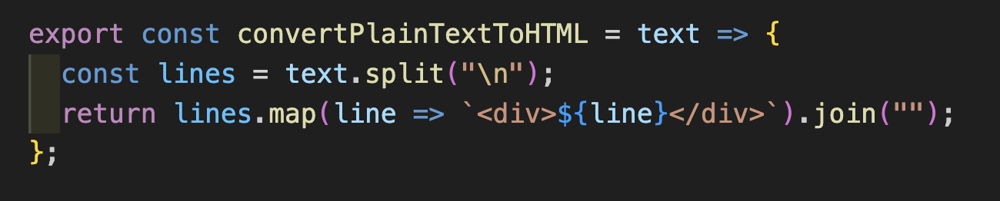

목차

---

- [동기](#동기)
- [프로젝트 관심사](#프로젝트-관심사)
- [주요 기능 소개](#주요-기능-소개)
- [기술스택](#기술스택)
- [리팩터링 계획](#리팩터링-계획)
- [느낀점](#느낀점)
- [연락처](#연락처)

---

# 동기

- 평소 노트에 필기하는 걸 좋아했습니다. 그런데 이런 노트를 그냥 버리기 아까울 때가 많았습니다. 생각이 어떻게 발전되어 왔는지를 되돌아볼 수 있었기 때문이었습니다. 따라서 사용자가 노트를 작성하여 이를 보관하고 다른 사용자와 공유도 할 수 있는 웹 메모 애플리케이션을 제작하게 되었습니다.

# 프로젝트 관심사

## div contentEditable

### div contentEditable 도입한 이유

- text editor 기능이 포함된 memo aplication을 구현하기 위해 사용자의 입력을 전달받아야 했습니다. 이를 위해서 처음에는 `textarea` 태그를 사용하여 개발을 시작하였습니다.`textarea`를 사용하면 별도의 추가 조치 없이 사용자 input을 렌더링할 수 있습니다. 하지만 사용자의 cursor 위치를 시각화하여 함께 메모하기 기능을 구현하기 위해서 Selection API와 Range API를 사용했어야만 했는데, `textarea`에서 JavaScript의 Selection과 Range API를 사용하기가 어렵다는 것을 알게 되었습니다. 그 이유는 Selection과 Range API는 주로 contenteditable 속성을 가진 요소나 document 객체에서 작동하도록 설계되었는데, `textarea`는 텍스트가 DOM 노드로 분리되어 있지 않고 단일한 문자열로 취급되기 때문에, 이러한 API를 사용하는 것이 어렵거나 비효율적일 수 있기 때문입니다.(`textarea` Selection과 Range API를 사용하는 것보다는 `textarea` 자체의 속성과 메서드를 사용하여 텍스트 선택과 조작을 하는 것이 일반적입니다. 예를 들어, textarea의 value, selectionStart, selectionEnd 속성을 사용하여 사용자의 텍스트 선택을 관리하거나 조작할 수 있습니다.) 또한 텍스트 에디터 기능, 예를 들어 사용자가 글씨를 쓰고 제목을 표시하게 하는 기능, 마크다운 문법 적용 등을 적용하는 데 한계가 있다고 생각했습니다. 따라서 프로젝트가 텍스트 에디터로 확장될 것을 고려하여서 개발 도중 `textarea` 방식을 사용하는 것을 중단하고 `div contentEditable`을 이용하여 프로덕트를 개발하게 되었습니다.

### 비제어 컴포넌트

- “contentEditable” 속성이 있는 요소는 사용자가 웹페이지에서 직접 DOM을 편집할 수 있는 요소입니다. `div contentEditable` 방식은 React 컴포넌트의 데이터 흐름에서 벗어나 사용자에 의해 제어되지 않은 입력값이 렌더링 되기에 비제어 컴포넌트 방식이라고 할 수 있습니다.

- React가 직접 상태 제어를 하는 컴포넌트를 Controlled Components라고 부르며, 브라우저가 상태 제어를 하는 컴포넌트를 Uncontrolled Components라고 부릅니다. `input`은 onChange 로 value를 상태 관리하며 이를 두고 React가 데이터가 관리한다고 하여서 제어 컴포넌트라고 부릅니다. 이같이 React 통제 아래의 제어 컴포넌트에서는 데이터 흐름이 위에서 아래로만 작동합니다. 즉, 최상위 수준에서 모델을 관리하고 해당 데이터를 나타내는 가상 DOM을 유지한 다음 해당 가상 DOM을 기반으로 DOM 트리를 렌더링합니다. `div contentEditable` input과 동작 방식이 다릅니다. 먼저, 입력 시 change event가 아니라 input event가 동작합니다. 또한, input이 아니기 때문에 value 값이 없습니다. 이 때문에 제어 컴포넌트처럼 리액트가 DOM을 제어할 수가 없고 따라서 비제어 컴포넌트 방식으로 contentEditable을 관리해 줘야 합니다.

### 비제어 컴포넌트를 사용하여 사용자 입력값 감지

- 결론적으로 말해서, 프로젝트에서 사용한 방식을 정리하면 다음과 같습니다.

1. contentEditable 속성 사용: div 태그에 contentEditable="true" 속성을 부여하여 사용자가 해당 요소 내부에서 텍스트를 편집할 수 있게 합니다. 이렇게 하면 전통적인 입력 필드(input, textarea 등) 외의 요소도 텍스트 입력을 받을 수 있게 됩니다.

2. 사용자 입력 추적: 사용자가 텍스트를 입력하면 이벤트 핸들러를 통해 event.target.innerHTML 또는 event.currentTarget.innerHTML에서 변경된 HTML 콘텐츠를 얻을 수 있습니다. 이를 통해 사용자가 편집한 텍스트 내용을 추적할 수 있습니다.

3. 상태 관리: React의 상태 관리 기능을 사용하여 div의 내용을 저장하고 관리합니다. 이를 위해 상태 변수를 선언하고, 사용자의 입력에 따라 이 변수의 값을 업데이트합니다. 이 상태 변수는 프로젝트의 기능 (CRUD, image download)을 구현하는데 이용됩니다.

4. useRef를 이용한 요소 접근: React의 useRef 훅을 사용하여 div 요소에 직접 접근합니다. 이를 통해 필요할 때 div 요소의 내용을 직접 조작하거나 정보를 얻을 수 있습니다.

5. useEffect를 이용한 렌더링 최적화: useEffect 훅의 의존성 배열에 상태 변수를 넣어 사용자의 입력이 있을 때마다 컴포넌트가 적절히 렌더링되도록 합니다. 이를 통해 사용자 입력에 따라 UI가 업데이트되는 것을 보장합니다.

contentEditable 속성을 사용하여 비제어 컴포넌트 방식으로 사용자 입력을 처리하고, React의 상태 관리 및 라이프사이클 기능과 결합하여 UI 업데이트를 구현하였습니다.

### 사용자 입력 값을 렌더링할 때 발생했던 문제

1. “A component is “contentEditable” and contains “children” managed by React 경고

- 사용자가 입력한 값은 contentEditable 영역의 `event.target.innerHTML`에서 조회할 수 있습니다. 이 값을 상태로 관리하고 상태를 div contentEditable의 content 영역에 넣게 되면 렌더링 시 cursor 초기화 및 warning이 발생합니다.

- 이 warning은 `suppressContentEditableWarning={true}`를 통해 막을 수도 있습니다. 하지만 element의 innerHTML을 직접 조작하는 방식은 React의 제어 밖이기 때문에, 따라서 React는 DOM이 변경되었는지 알 수가 없습니다. 사용자가 contentEditable element를 수정하면 실제 DOM이 변경됩니다. React의 가상 DOM은 이러한 변경사항을 자동으로 인식하지 않습니다. 결국 다음 렌더링 시에 콘텐츠에 해당 DOM 노드의 올바른 상태라고 생각하는 것을 React가 overwrite 시켜서 사용자 Input과 sync가 맞지 않기 때문에 문제가 발생합니다.

- 실제 DOM 조작에 의해서 React 가상 DOM을 일관되게 유지하는데 문제가 될 수 있습니다. 또 innerHTML을 적절하지 않은 방식으로 사용하면 cross-site scripting (XSS) 공격에 노출될 수 있습니다.

2. dangerouslySetInnerHTML property on an element 방식에서 cursor 위치 초기화가 발생

- 따라서 element의 innerHTML를 조작하는 방식 대신 element에 `dangerouslySetInnerHTML` 속성을 부여하는 것을 적용해 보았습니다. `dangerouslySetInnerHTML`은 innerHTML을 직접 조작하는 방식과는 달리 React의 메서드입니다. React는 가상 DOM을 사용하기 때문에 실제 DOM과 차이를 비교할 때 HTML이 다른 소스에서 왔다는 것을 알기 때문에 해당 노드의 자식을 검사하는 것을 바로 건너뛸 수 있습니다. 따라서 성능이 향상됩니다.

- `dangerouslySetInnerHTML`을 통해 텍스트 입력 값을 상태로 관리하게 되면 입력 시마다 상태가 변경이 되고 React에 의해 렌더링이 발생해서 cursor가 초기화되는 문제가 있었는데, 이를 carret jump라고 부른다는 것을 알게 되었습니다. 따라서 carret jump 없이 사용자 입력에 따라서 컴포넌트를 업데이트할 방법을 찾아야만 했습니다.

- 결론: `div contentEditable`을 어떤 방식으로 렌더링 할 것인지에 대해 몇 번의 우여곡절이 있었습니다.`contentEditable = true`로 변경하고 사용자가 텍스트를 입력하면 텍스트 값 `event.target.innerHTML`에서 확인할 수 있습니다. `event.currentTarget.innerHTML`를 의 값을 상태 관리하였습니다. `div contentEditable`의 값을 업데이트하기 위해서 해당 요소에 접근하기 위해 useRef를 사용했습니다. 그리고 useEffect의 의존성 배열에 `event.currentTarget.innerHTML`을 담은 변수를 넣어서 텍스트 값이 갱신 될 때마다 rendering 되게 하였습니다.

### image download 기능에서 발생했던 문제

- 여러 차례 실험 끝에 rendering 자체는 문제가 없어 보였지만, 프로젝트의 핵심 기능인 image download 기능에서 문제가 발생하였습니다. contentEditable 속성이 있는 `div` 에서 사용자가 enter 키를 누르면, Web browser는 새로운 줄을 생성하기 위해 새로운 `
` 태그를 자동으로 삽입합니다. 줄 변경을 하고 나서 download button을 누르면 image에서 사용자가 입력한 텍스트와 `div` 태그가 함께 나타나는 문제가 발생했습니다.

  

`convertPlainTextToHTML`를 사용하여, HTML 요소의 구조와 상관없이 내부의 텍스트 값만 추출하고, 줄바꿈을 적절히 유지하여 일반 텍스트로 변환할 수 있게 되었습니다. `convertToHTMLToPlainText`의 반환값, 즉 텍스트만을 상태 관리하여서 image를 저장하는 함수에 매개 변수로 전달하여 텍스트 줄 변경이 반영되어 image로 download할 수 있도록 하였습니다.

  

1. `convertHTMLToPlainText` 함수는 모든 자식 노드를 순회하면서 노드가 **`
`** 또는 **`
`**이면, 노드의 텍스트 콘텐츠 앞에 줄바꿈 문자 (**`"\n"`**)를 추가합니다. 변환된 텍스트가 줄바꿈 문자로 시작한다면, 그 문자를 제거합니다. 마지막으로 변환된 텍스트를 반환합니다.

  

- `convertToHTMLToPlainText`의 반환값, 즉 평문으로 바꾼 입력값을 상태 관리하였고, 이를 서버에 보내고, myPage에서 서버에서 다시 text를 조회할 때 평문을 받아오니까 이제 줄 변경 되지 않고 일렬로 렌더링 되는 문제가 발생하였습니다.

  

- `convertPlainTextToHTML` 함수를 통해서 서버에서 Text를 조회하고 다시 TextEditor에 렌더링 시 줄 변경을 적용하기 위해 div 태그로 text를 래핑 한 값을 반환하도록 하였습니다.

## 소켓을 이용한 실시간 메모 기능

### Socket IO 도입 이유

- Google Docs의 사용자 cursor 시각화 기능과 slack에서 사용자 typing 표시 기능을 따라해서 프로젝트에 함께 메모하는 기능을 도입하고 싶었습니다.

### cursorPosition sync 맞지 않는 문제가 발생했고 어떻게 해결했는지?

- room에 참여한 사용자의 cursor 위치를 시각화하였습니다. getBoundingClientRect()은 해당 element의 viewport 내부에서 위치를 계산합니다. 그로 인해 사용자 browser 크기에 따라 profile icon의 배치가 맞지 않는 문제가 발생하였습니다. getBoundingClientRect()으로 profile icon이 그려질 상위 영역인 TextEditor의 좌표를 얻고 이 위치에 기존의 cursor 좌푯값을 더하는 방식으로 cursor 위치를 계산했습니다. 그 결과 browser 크기가 달라져도 cursor 위치에 profile icon을 배치할 수 있었습니다.

# 주요 기능 소개

- 함께 메모하기 기능

- 텍스트 생성 (색상 변경, 이미지 다운로드 기능)
  

- 손글씨 인식 (OCR 기능)

# 기술스택

- Front-end:
  - JS, ReactJS
- Back-end:
  - Node.js, Express.js
- Database:
  - MongoDB
- 상태 관리
  - zustand

# 리팩터링 계획

- 추가 예정

# 느낀점

- 프로젝트가 익숙하지 않은 비제어 컴포넌트로 인해 리액트의 일반적인 흐름에서 벗어나니 로직이 복잡해지고 불필요한 함수가 만들고 이해하기가 더 어려워진 측면이 있었던 것 같습니다. 지금 당장보다도 미래를 대비한답시고 충분한 POC 없이 새로운 방식을 시도한 결과라고 생각합니다. 차라리 `textArea`와 같은 제어 컴포넌트를 사용하고 richText 기능을 위해서는 Draft.js 같은 라이브러리를 추가 도입하는 것이 어쩌면 더 나았을 수도 있었을 것 같습니다. 하지만 `div contentEditable`를 사용하고 이를 이해하기 위한 과정 속에서 DOM, React에 대해 조사하는 과정이 정말 좋았습니다. 기존에 DOM, React에 대해 잘 이해하지 못했던 것을 이번 프로젝트에서 조금이나마 알게 되어서 정말로 유익한 시간이었던 것 같습니다.

- 혼자서 프로젝트를 진행하면서 실패한다는 것에 대해 부끄러워지지 않게 된 점이 좋았습니다. 실패하지 않는다는 것은 제대로 시도하지 않았다는 것이니까요. 그런 점에서 프로젝트 중 렌더링 방식을 `textArea`에서 `div contentEditable`로 변경하고 이를 위해 자료조사를 하고 실험해 보는 일련의 과정이 앞으로 개발하는 데 있어 중요한 경험이 되었다고 생각합니다. 실패를 부끄러워하지 않고 과정 중에서 경험한 걸 기록하고 다시금 공부해서 시도해 보는 개발자가 되겠습니다. 그래서 어제보다 더 성장한 동료가 될 수 있도록 노력하겠습니다.

# 연락처

<table>
  <tr>
    <td align="center">
      
    </td>
  </tr>
  <tr>
    <td>
      <ul>
        <li><a href="https://github.com/donghyukkil">길동혁</a></li>
		    <li>asterism90@gmail.com</li>
	    </ul>
    </td>
  </tr>
</table>
